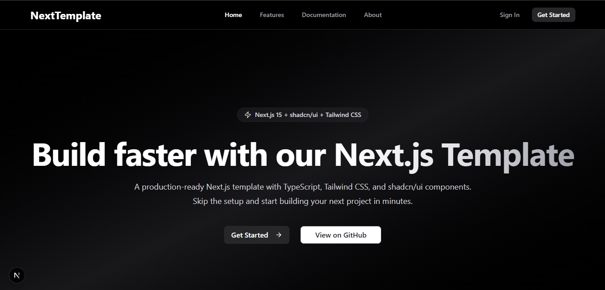

# 🚀 Next.js Template with shadcn/ui

A modern, production-ready Next.js template with Tailwind CSS, shadcn/ui components, and TypeScript pre-configured. Perfect for quickly bootstrapping your next project with industry best practices.



## ✨ Features

- ⚡ **Next.js 15** - Latest version with App Router and Turbopack
- 🎨 **Tailwind CSS 4** - Utility-first CSS framework
- 🧩 **shadcn/ui** - Beautiful, accessible components built on Radix UI
- 📱 **Responsive Design** - Mobile-first approach
- 🔧 **TypeScript** - Full type safety
- 🎯 **ESLint** - Code linting and formatting
- 🚀 **Vercel Ready** - Optimized for deployment
- 🌙 **Dark Mode** - Built-in dark/light theme support
- 📦 **Component Library** - Pre-built UI components

## 🛠️ Tech Stack

- **Framework:** Next.js 15
- **Language:** TypeScript
- **Styling:** Tailwind CSS 4
- **Components:** shadcn/ui + Radix UI
- **Icons:** Lucide React
- **Package Manager:** npm

## 🚀 Quick Start

### 1. Fork or Clone this repository

```bash
git clone https://github.com/AhqafCoder/nextjs-template.git
cd nextjs-template
```

### 2. Install dependencies

```bash
cd client
npm install
```

### 3. Run the development server

```bash
npm run dev
```

Open [http://localhost:3000](http://localhost:3000) in your browser to see the result.

## 📁 Project Structure

```
client/
├── src/
│   ├── app/
│   │   ├── globals.css
│   │   ├── layout.tsx
│   │   └── page.tsx
│   ├── components/
│   │   └── ui/
│   │       └── button.tsx
│   └── lib/
│       └── utils.ts
├── public/
├── components.json
├── package.json
├── tailwind.config.js
└── tsconfig.json
```

## 🎨 Available Components

This template comes with shadcn/ui components pre-configured:

- **Button** - Various button styles and sizes
- **Card** - Content containers
- **Input** - Form inputs
- **Label** - Form labels
- And many more...

### Adding New Components

To add more shadcn/ui components:

```bash
npx shadcn@latest add [component-name]
```

Example:
```bash
npx shadcn@latest add card
npx shadcn@latest add input
npx shadcn@latest add dialog
```

## 🔧 Configuration

### Tailwind CSS

The template uses Tailwind CSS 4 with custom configuration. Modify `tailwind.config.js` to customize your design system.

### shadcn/ui

Components are configured in `components.json`:
- **Style:** New York
- **Base Color:** Zinc
- **CSS Variables:** Enabled
- **Icon Library:** Lucide React

## 📝 Scripts

- `npm run dev` - Start development server with Turbopack
- `npm run build` - Build for production
- `npm start` - Start production server
- `npm run lint` - Run ESLint

## 🚀 Deployment

### Deploy on Vercel

The easiest way to deploy your Next.js app is to use the [Vercel Platform](https://vercel.com/new).

[](https://vercel.com/new/clone?repository-url=https://github.com/yourusername/nextjs-template)

### Other Platforms

This template works with any platform that supports Next.js:
- Netlify
- Railway
- Render
- AWS Amplify

## 🤝 Contributing

Contributions are welcome! Please feel free to submit a Pull Request.

1. Fork the project
2. Create your feature branch (`git checkout -b feature/AmazingFeature`)
3. Commit your changes (`git commit -m 'Add some AmazingFeature'`)
4. Push to the branch (`git push origin feature/AmazingFeature`)
5. Open a Pull Request

## 📄 License

This project is licensed under the MIT License - see the [LICENSE](LICENSE) file for details.

## 🙏 Acknowledgments

- [Next.js](https://nextjs.org/) - The React framework
- [Tailwind CSS](https://tailwindcss.com/) - Utility-first CSS framework
- [shadcn/ui](https://ui.shadcn.com/) - Beautiful component library
- [Radix UI](https://www.radix-ui.com/) - Low-level UI primitives
- [Lucide](https://lucide.dev/) - Beautiful & consistent icons

---

⭐ If this template helped you, please give it a star!
